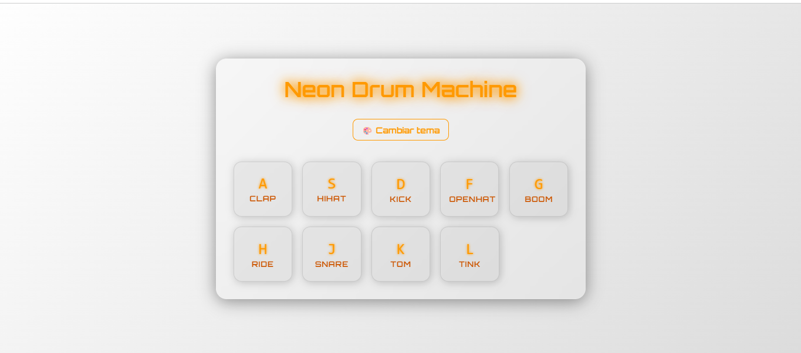

# Drum Machine App

A modern, responsive, and touch-friendly web drum machine with keyboard and mouse/touch support, dynamic theme switching, and smooth animations built using HTML, CSS and JavaScript.

---

## Demo

  



---

## Features

- Keyboard Support: Play sounds by pressing the corresponding keyboard keys.
- Mouse and Touch Support: Click or tap on-screen keys to play sounds.
- Multiple Drum Sounds: Includes a variety of drum sounds like clap, hihat, kick, snare, and more.
- Smooth Animations: Keys light up and scale when played, with transition effects.
- Dynamic Theme Switching: Switch between multiple stylish themes (default, light, synthwave) with glowing effects.
- Mobile-Friendly UI: Responsive layout with touch-friendly buttons optimized for mobile devices.
- Clean and Modern Design.
- Performance: Immediate sound playback with audio reset for overlapping sounds.

## How to Use
- Press the keys shown on the screen or corresponding keyboard keys (A, S, D, F, G, H, J, K, L).
- Click or tap the keys to play sounds.
- Use the theme toggle button to cycle through different visual themes.

---

## Technologies Used

- HTML5
- CSS3 
- JavaScript

---

## Getting Started

### Prerequisites

- Modern web browser (Chrome, Firefox, Edge, Safari)
- Internet connection (to fetch weather data)

### Setup

1. Clone the repository:

```bash
git clone https://github.com/your-username/drum_machine.git
cd drum-machine
